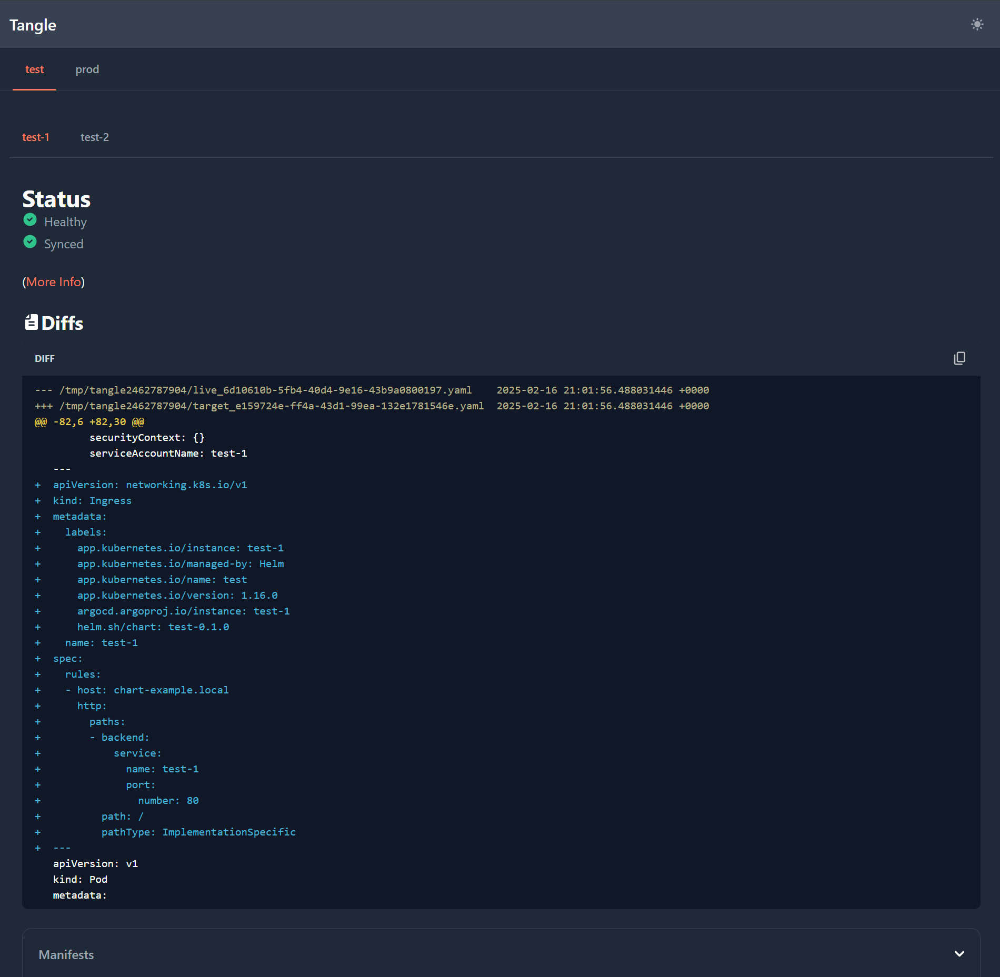

# Tangle

[](https://results.pre-commit.ci/latest/github/ivanklee86/tangle/main) [](https://github.com/ivanklee86/tangle/actions/workflows/ci.yaml)

**tangle** (_noun_): A theoretical name for a group of octopuses since in the wild they are solitary creatures.

Tangle makes using with multiple ArgoCDs in a [hub and spoke](https://codefresh.io/learn/argo-cd/a-comprehensive-overview-of-argo-cd-architectures-2024/#post-24596-_1k4hvnsqwl60) architecture fun (🎉) and easy (😅).  Its does this by:

- Showing `Applications` across multiple ArgoCD.
- Showing manifest diffs for many `Applications` across multiple ArgoCD.
- Working equally well for your CI/CD tooling (i.e. available as JSON APIs to consume from your tools) and for your humans (via a website that's easy to embed into existing tools).
- Does all those things with mechanisms (i.e. worker pools) to limit load on ArgoCD components

**Example: View all Applications with the `env:test` label**

Visiting `/applications?labels=env:test`


**Example: View diffs of all Applications with the `env:test` label from the `test_gitops` branch**

Visiting `/diffs?labels=env:test&targetRef=test_gitops`



## Installation

Tangle is distributed as a Docker image and can be installed on Kubernetes via [Helm charts](https://github.com/ivanklee86/tangle-deployments/tree/main/charts/tangle).

You can try out Tangle locally by:
- Cloning the repository and opening it as a Dev Container.
- Run `task services` to start a Kubernetes cluster with ArgoCD and a few `Applications`.
- Start Tangle with the following command.

```shell
docker run --rm -it -v `pwd`/integration:/config -e TANGLE_CONFIG_PATH=/config/tangle.yaml --network=host --env-file .env ghcr.io/ivanklee86/tangle:latest
```

## Configuration

### ArgoCD
Tangle uses a JWT to authenticate to ArgoCD. This can be configured in the Helm chart as follows:
```yaml
configs:
  cm:
    accounts.YOUR_ACCOUNT_NAME: apiKey

  rbac:
    policy.csv: |
      p, role:tangle, applications, get, *, allow
      g, YOUR_ACCOUNT_NAME, role:tangle
```

A JWT can be then generated using the ArgoCD CLI using the following command:
```shell
argocd login # Using username/password or SSO
argocd account generate-token --account YOUR_ACCOUNT
```

### Tangle

The `tangle.yaml` file is the primary configuration file and specifies how Tangle connects to your ArgoCD servers.

```yaml
argocds: # This section defines ArgoCD instances.
  test:
    address: "localhost:8080" # Address of the ArgoCD instance.  Should NOT have https://
    insecure: true # Optional, can omit if ArgoCD has a proper certification.
    authTokenEnvVar: "ARGOCD_TOKEN"  # Name of environment variable containing ArgoCD JWT.
  prod:
    address: "localhost:8080"
    insecure: true
    authTokenEnvVar: "ARGOCD_PROD_TOKEN"

sortOrder:  # This section allows you to configure the order of ArgoCDs in the web UI.
  - test
  - prod
```

Additional configurations can be configured in the `tangle.yaml` or via environment variables with the `TANGLE_<var>` format.

|Configuration | Required? | Default Value | Description |
|--------------|-----------|---------------|-------------|
| timeout | No | 60 (seconds) | Timeout on ArgoCD queries |

## Usage

### API

Swagger documentation is exposed at `/swagger`.

### Web UI

The Web UI is accessible at `/`.

### Metrics

Prometheus metrics are exposed at `/metrics`
