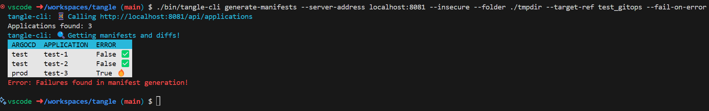

# Tangle

 

**tangle** (_noun_): A theoretical name for a group of octopuses since in the wild they are solitary creatures.

Tangle makes using with multiple ArgoCDs in a [hub and spoke](https://codefresh.io/learn/argo-cd/a-comprehensive-overview-of-argo-cd-architectures-2024/#post-24596-_1k4hvnsqwl60) architecture fun (🎉) and easy (😅).  Its does this by:

- Showing `Applications` across multiple ArgoCD.
- Showing manifest diffs for many `Applications` across multiple ArgoCD.
- Working equally well for your CI/CD tooling (i.e. available as JSON APIs to consume from your tools) and for your humans (via a website that's easy to embed into existing tools).
- Does all those things with mechanisms (i.e. worker pools) to limit load on ArgoCD components

**Example: View all Applications with the `env:test` label**

Visiting `/applications?labels=env:test`

**Example: View diffs of all Applications with the `env:test` label from the `test_gitops` branch**

Visiting `/diffs?labels=env:test&targetRef=test_gitops`

**Example: Using `tangle-cli` from your CI/CD pipelines**

