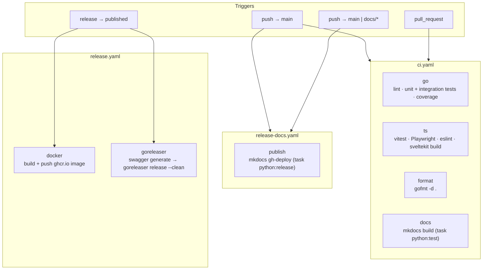

# CI

How the GitHub Actions pipelines fit together, for planning improvements. For runtime
architecture, see [Internals](internals.md).

Three workflows, each triggered independently: [`ci.yaml`](../../.github/workflows/ci.yaml) gates
every push and PR, [`release-docs.yaml`](../../.github/workflows/release-docs.yaml) republishes
docs on every push to `main`, and [`release.yaml`](../../.github/workflows/release.yaml) ships
artifacts when a GitHub Release is published.

## Pipeline

All four `ci.yaml` jobs and both `release.yaml` jobs run on independent runners with no `needs:`
between them — there is no ordering or shared cache today, so `go`, `ts`, `format`, and `docs` each
pay their own checkout and toolchain-install cost, and `docker`/`goreleaser` each rebuild from a
clean checkout.

## The `go` job: real ArgoCD, not mocks

The `go` job is the only one that runs integration tests, and it does so against a real cluster
rather than a mocked ArgoCD API:

1. Install Go 1.27, [Task](https://taskfile.dev), Docker, [k3d](https://k3d.io) `v5.9.0`
   (pinned in step; kept in sync with `.devcontainer/Dockerfile`), and the `argocd` CLI
   `v3.5.3` (same sync comment).
2. `task go:install-ci` — Go deps + CI tooling (`tasks/go.yaml`).
3. `task go:generate` — regenerates the Swagger spec that `tangle-server` embeds.
4. `task go:lint`.
5. `task services:cicd` (`Taskfile.yaml`) — this is the expensive step: it tears down and
   recreates a k3d cluster, waits for a real ArgoCD install to become healthy, mints an ArgoCD
   API token, builds the `tangle` Docker image, and runs it against that live ArgoCD on the host
   network (`tasks/docker.yaml` `docker:build` + `docker run --network=host`).
6. `task go:test-ci` — Go tests (including integration tests that hit the container from step 5)
   plus coverage.
7. Publish JUnit results (`report.xml`) via `EnricoMi/publish-unit-test-result-action`, convert
   coverage to lcov, upload to Codecov, and upload the HTML coverage report as a build artifact.

Everything else in `ci.yaml` is comparatively self-contained: `ts` installs Node 24 and a
pinned-version Playwright Chromium build (invoked via `node node_modules/playwright/cli.js`
rather than `npx`, to dodge a bin-name collision with `@playwright/test`'s own bundled
`playwright`), `format` only needs `gofmt`, and `docs` only needs `uv` to build the mkdocs site.

## Things worth revisiting

- No job dependencies/ordering: a fast, cheap check (e.g. `format`) provides no fail-fast benefit
  today since all four `ci.yaml` jobs are scheduled together.
- No caching of Go modules, npm packages, or the k3d/ArgoCD CLI downloads across runs.
- `services:cicd` rebuilds the Docker image and stands up a whole k3d + ArgoCD cluster on every
  CI run just to exercise the diff/refresh code paths against a live ArgoCD — the slowest step by
  a wide margin.
- `release-docs.yaml` triggers on every push to `main`, independent of whether `docs/` changed.
- `release.yaml`'s `goreleaser` job re-runs `task go:generate` (Swagger) even though the release
  is cut from a tag that already passed `ci.yaml` on `main`.
