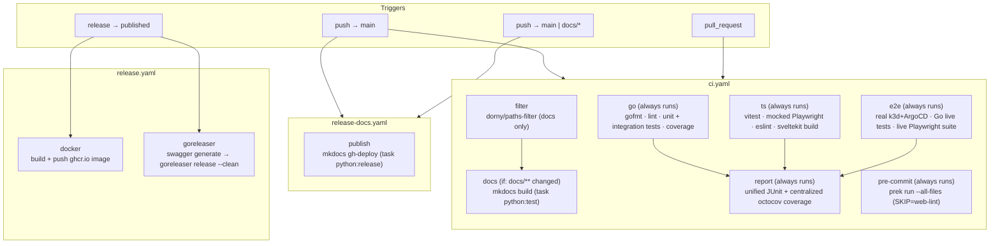

# CI

How the GitHub Actions pipelines fit together, for planning improvements. For runtime
architecture, see [Internals](internals.md).

Three workflows, each triggered independently: [`ci.yaml`](../../.github/workflows/ci.yaml) gates
every push and PR, [`release-docs.yaml`](../../.github/workflows/release-docs.yaml) republishes
docs on every push to `main`, and [`release.yaml`](../../.github/workflows/release.yaml) ships
artifacts when a GitHub Release is published.

## Pipeline

`ci.yaml` builds out a full test pyramid — fast, always-run unit/integration checks for Go and the
frontend, plus one always-run e2e job against a real ArgoCD — per
[ADR 0009](../adrs/0009-ci-pipeline-test-taxonomy-and-conditional-jobs.md) and
[ADR 0017](../adrs/0017-always-run-go-and-ts-ci-jobs.md) (which dropped `go`/`ts`'s original
path-conditional gating once `e2e`'s always-run design made it stop saving any developer wait
time):

`docs` is the only job still gated on `filter`'s path output, and skips cleanly (green, skipped —
not pending) when `docs/**` (excluding `docs/agents/**`) isn't touched; a skipped job still
satisfies branch-protection required checks naming it. `go` and `ts` used to be gated the same way,
but [ADR 0017](../adrs/0017-always-run-go-and-ts-ci-jobs.md) dropped that once `e2e`'s always-run
design meant skipping them no longer saved any developer wait time, only runner-minutes — so `go`,
`ts`, `e2e`, and `pre-commit` all now have no `if:` and run on every push and PR. `e2e` remains the
one place real ArgoCD/browser coverage happens for both languages. `pre-commit` has no `if:` for a
different reason — most of its hooks (`trailing-whitespace`, `check-yaml`, `markdownlint-cli2`,
`renovate-config-validator`) are repo-wide with no single ecosystem path to filter on; it replaced
the hosted pre-commit.ci service with a self-hosted [prek](https://github.com/j178/prek) run once
the repo standardized on prek locally
([ADR 0014](../adrs/0014-drop-precommit-ci-run-prek-in-actions.md)) — `web-lint` stays skipped
(`SKIP=web-lint`) since `ts`'s own `task ts:lint` already gates it for real. `report`'s
`needs: [go, ts, e2e]` with `if: always()` (deliberately not `pre-commit`, which produces no JUnit
output to merge) means it still runs and produces a combined result even if one of its three inputs
fails outright — that's now the only reason `if: always()` matters here, since `go`/`ts` no longer
skip for path reasons the way they did under ADR 0009. Its coverage report still works the same
way: `go`/`e2e` upload their raw coverage profiles as artifacts rather than each running
[octocov](https://github.com/k1LoW/octocov) (ADR 0010) itself; `report` is the one place that runs,
downloading and merging whichever of the two are actually available.

## The test pyramid

Both languages now split unit/integration (fast, always-run, no live dependencies) from e2e (slow,
always-run, real ArgoCD) — per [ADR 0017](../adrs/0017-always-run-go-and-ts-ci-jobs.md), the
unit/integration layer is no longer path-conditional either:

| Layer | Go | TS | Runs in | Gated on |
| --- | --- | --- | --- | --- |
| Unit | `pkg/client`, `internal/tangle` (server/loader/manifests), `internal/cli/output_test.go` | `*.spec.ts`, `*.svelte.test.ts` (vitest) | `go` / `ts` | Always runs |
| Integration (mock/fixture-backed) | `internal/argocd` (via `internal/argocd/argocdfakes`), `internal/tangle/handlers_test.go`, CLI round-trip tests (via `httptest.NewServer`) | `web/e2e/mocked/*.spec.ts` (Playwright, network-mocked via `page.route`) | `go` / `ts` | Always runs |
| E2E (real ArgoCD, real browser) | `internal/argocd/client_e2e_test.go`, `internal/tangle/server_e2e_test.go` (`//go:build e2e`) | `web/e2e/live/*.spec.ts` (Playwright, real cluster, `playwright.live.config.ts`) | `e2e` | Always runs |

`go test ./...` (no build tag) needs no `.env`, live ArgoCD, or Docker — it's a pure, fast
unit+integration suite. `go test -tags=e2e ./...` needs `task services:cicd` up and `.env`
populated by `task argocd:token`. On the frontend, `npm run test` covers unit + the mocked suite;
the live suite runs separately via `task ts:test:e2e:live` (no local dev server — it targets a real
`tangle-server` on `:8081`).

## The `e2e` job: real ArgoCD, not mocks

`e2e` is the only job that runs against a real cluster rather than a fake/mocked ArgoCD API. It
was also the first job with no path-based `if:` at all — `go` and `ts` now share that (per
[ADR 0017](../adrs/0017-always-run-go-and-ts-ci-jobs.md)); only `docs` still skips based on
`filter`'s output:

1. Install Go 1.27, Node 24, [Task](https://taskfile.dev), [k3d](https://k3d.io), and the `argocd`
   CLI — both k3d/argocd versions come from this job's own `env: K3D_VERSION`/`ARGOCD_VERSION`
   (`v5.9.0`/`v3.5.3`), which `renovate.json`'s "k8s" group also tracks alongside
   `.devcontainer/Dockerfile`'s copies, so a Renovate bump moves both files together instead of
   relying on a comment. Task comes from the local `./.github/actions/setup-task` composite action
   rather than `arduino/setup-task` directly — see
   [ADR 0018](../adrs/0018-pin-and-cache-the-task-cli-in-ci.md). No separate Docker setup step —
   `ubuntu-latest` ships a recent enough Docker/Buildx already.
2. `task go:install-ci` — Go deps + CI tooling; `task go:generate` — regenerates the Swagger spec.
3. `task services:cicd` (`Taskfile.yaml`) — the expensive step: tears down and recreates a k3d
   cluster, waits for a real ArgoCD install to become healthy, mints an ArgoCD API token, builds
   the `tangle` Docker image via buildx with the GitHub Actions cache backend (including the
   frontend build), and runs it against that live ArgoCD on the host network.
4. `task go:test:e2e:ci` — the `//go:build e2e` Go tests (only the `TestE2E_`-prefixed ones — a
   plain `-tags=e2e` build still compiles every untagged unit/integration test alongside them, so
   `-run '^TestE2E_'` keeps them out of this job's own report), plus coverage (`report-e2e.xml`,
   `coverage-e2e.out`/`.html`, kept separate from the `go` job's own report/coverage filenames).
5. Install the frontend's npm packages and pinned Playwright browser, then
   `task ts:test:e2e:live` — the live-stack Playwright suite against the container from step 3.
6. Publish JUnit results (both the Go e2e suite and the frontend live suite) and upload them, plus
   the raw `coverage-e2e.out` profile, as build artifacts for the `report` job.

Go module/tool-binary caching, npm caching, Playwright-browser caching, k3d/argocd CLI caching
(workstream 12), and Task CLI caching ([ADR 0018](../adrs/0018-pin-and-cache-the-task-cli-in-ci.md))
all apply here too, alongside the Docker layer cache — this is the one job that pays for all of
them on every run, since it's the only job that also stands up a real k3d/ArgoCD cluster and builds
the Docker image.

The `go` job, by contrast, is now fully hermetic: it folds in what used to be the standalone
`format` job (a `gofmt` check, first, before installing the rest of the Go toolchain) and runs only
`internal/argocd/argocdfakes`-backed unit/integration tests — no Docker, k3d, or ArgoCD CLI install
at all. It uploads its own raw `coverage.out` alongside the rendered `coverage.html`, but doesn't
run octocov itself (see the `report` job below). `ts` similarly runs unit tests and the mocked
(network-stubbed) Playwright suite, installing a pinned-version Playwright Chromium build (invoked
via `node node_modules/playwright/cli.js` rather than `npx`, to dodge a bin-name collision with
`@playwright/test`'s own bundled `playwright`). `docs` only needs `uv` to build the mkdocs site.
`pre-commit` is the leanest of the always-run jobs: checkout, a pinned Go toolchain (`go-fmt` is
`language: script` in `dnephin/pre-commit-golang`, so prek doesn't provision one itself), then
[`j178/prek-action`](https://github.com/j178/prek-action) (SHA-pinned) runs the rest of
`.pre-commit-config.yaml`'s hooks — no Node/npm install, since `web-lint` is skipped here.

## The `report` job: unified tests and coverage

Once `go`/`ts`/`e2e` all use JUnit-format test results and `go`/`e2e` both produce a Go coverage
profile, one job downstream of all three can centralize both instead of each producing its own,
partial version:

1. Download every `*-junit-report` artifact (`go`, `ts`, `e2e` — whichever ran) into one directory
   and publish them as a single "Unified Test Results" check.
2. Download every `*-coverage-profile` artifact — `go`'s `coverage.out` and `e2e`'s
   `coverage-e2e.out`, if present (a `go` job that fails outright just leaves that one missing,
   not erroring; `e2e` always runs, so there's always at least its own) — into one directory.
3. Run [octocov](https://github.com/k1LoW/octocov) (ADR 0010) once, pointed at both files via
   `.octocov.yml`'s `coverage.paths:`. octocov merges overlapping coverage itself (folding
   duplicate-covered lines rather than double-counting), so the resulting PR comment/diff reflects
   coverage from the fast unit/integration suite *and* the live e2e suite — not just whichever job
   used to run octocov alone. No external SaaS account or `CODECOV_TOKEN`; PR comments and the
   `artifact://` datastore are both authenticated with the workflow's own token.

One side effect worth knowing: a merged report measures *line* coverage, not exact statement
coverage — statement/block boundaries aren't reliably comparable across two separately-compiled
profile instances, only lines are (the same mechanism that would let this merge across formats
entirely, e.g. Go coverage + LCOV, not just two Go profiles). The percentage is still a legitimate
combined-coverage figure, just on a coarser basis than a single unmerged report's — confirmed by
comparing `octocov dump report` against each input file alone before landing this.

## Things worth revisiting

- **Resolved**: no job dependencies/ordering — `filter` now gates `docs` (`go`/`ts` always run,
  per [ADR 0017](../adrs/0017-always-run-go-and-ts-ci-jobs.md)), and `format`'s fail-fast concern
  is moot now that it's folded into `go` as its first step.
- **Resolved**: no caching of Go modules, npm packages, or the k3d/ArgoCD CLI downloads —
  [workstream 12](plans/ci-pipeline-restructure.md#12-ci-dependency-caching) landed this: Go
  module/build cache, Go tool-binary cache, npm cache, Playwright-browser cache, k3d/argocd CLI
  cache, and Docker layer caching via buildx + the GitHub Actions cache backend.
- **Resolved**: the Task CLI was the one dependency workstream 12 didn't cover — every job
  re-downloaded it, and, worse, `arduino/setup-task`'s default `version: 3.x` made each of them
  resolve that range through an *anonymous* `api.github.com` tag listing (60 requests/hour, shared
  across every repo building from the same runner IP), which is what started failing CI outright
  with `API rate limit exceeded`. All six call sites now go through the local
  [`./.github/actions/setup-task`](../../.github/actions/setup-task/action.yml) composite action:
  an exact pinned version (which short-circuits the tag lookup entirely, so there's no API call to
  rate-limit), an `actions/cache` restore of `${{ runner.tool_cache }}/task` so a hit skips the
  download, and `repo-token` as a backstop if the pin is ever loosened
  ([ADR 0018](../adrs/0018-pin-and-cache-the-task-cli-in-ci.md)).
- **Resolved**: pre-commit.ci (a hosted third-party GitHub App) has been dropped — a self-hosted
  `pre-commit` job now runs the same hook suite via [prek](https://github.com/j178/prek) directly
  in `ci.yaml`, the same tool already used locally
  ([ADR 0014](../adrs/0014-drop-precommit-ci-run-prek-in-actions.md)).
- **Resolved**: coverage reporting uses octocov instead of Codecov — no more
  `jandelgado/gcov2lcov-action`, `codecov/codecov-action`, or `CODECOV_TOKEN`
  ([ADR 0010](../adrs/0010-replace-codecov-with-octocov.md)/workstream 10). It runs centrally in
  the `report` job (see above), not in `go` — `go` and `e2e` each just upload their own raw
  coverage profile as an artifact.
- **Mostly done**: a durable, publicly-embeddable coverage badge and dashboard
  ([ADR 0011](../adrs/0011-octocov-central-reporting-and-badges-repository.md)/workstream 11) —
  `ivanklee86/octocov-central` exists, its scheduled workflow works, and GitHub Pages serves it live
  at `https://ivanklee86.github.io/octocov-central/`. **Open**: the dashboard is still empty and no
  badge exists yet, since both need `tangle`'s `main` branch to have run `ci.yaml` at least once
  (octocov's `report.if: is_default_branch`, evaluated in the `report` job) — the coverage badge
  hasn't been added to this repo's `README.md` yet, pending that.
- **Accepted trade-off, not an oversight**: `e2e` still stands up a whole k3d + ArgoCD cluster and
  rebuilds the Docker image on every run — the slowest step by a wide margin, and the one job every
  PR always waits on regardless of what changed. [ADR 0009](../adrs/0009-ci-pipeline-test-taxonomy-and-conditional-jobs.md)
  explicitly accepts this: the goal is full test-pyramid coverage for both languages, and overall CI
  wall-clock time is secondary to that. Workstream 12's caching makes the pieces of that bring-up
  cheaper to rebuild but doesn't remove the cluster bring-up itself.
- `release-docs.yaml` triggers on every push to `main`, independent of whether `docs/` changed.
- `release.yaml`'s `goreleaser` job re-runs `task go:generate` (Swagger) even though the release
  is cut from a tag that already passed `ci.yaml` on `main`.
