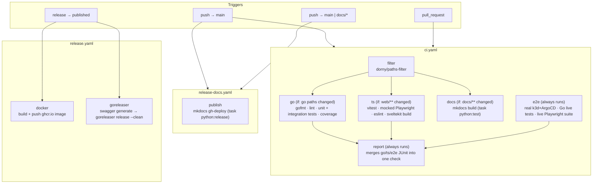

# CI

How the GitHub Actions pipelines fit together, for planning improvements. For runtime
architecture, see [Internals](internals.md).

Three workflows, each triggered independently: [`ci.yaml`](../../.github/workflows/ci.yaml) gates
every push and PR, [`release-docs.yaml`](../../.github/workflows/release-docs.yaml) republishes
docs on every push to `main`, and [`release.yaml`](../../.github/workflows/release.yaml) ships
artifacts when a GitHub Release is published.

## Pipeline

`ci.yaml` builds out a full test pyramid — fast, path-conditional unit/integration checks for Go
and the frontend, plus one always-run e2e job against a real ArgoCD — per
[ADR 0009](../adrs/0009-ci-pipeline-test-taxonomy-and-conditional-jobs.md):

`go`/`ts`/`docs` are gated on `filter`'s path outputs and skip cleanly (green, skipped — not
pending) when their paths aren't touched; a skipped job still satisfies branch-protection required
checks naming it. `e2e` has no `if:` — it always runs, since it's the one place real ArgoCD/browser
coverage happens for both languages. `report` `needs: [go, ts, e2e]` with `if: always()`, so it
still runs and produces a combined result even when `go`/`ts` were skipped.

## The test pyramid

Both languages now split unit/integration (fast, path-conditional, no live dependencies) from e2e
(slow, always-run, real ArgoCD):

| Layer | Go | TS | Runs in | Gated on |
|---|---|---|---|---|
| Unit | `pkg/client`, `internal/tangle` (server/loader/manifests), `internal/cli/output_test.go` | `*.spec.ts`, `*.svelte.test.ts` (vitest) | `go` / `ts` | Path filter |
| Integration (mock/fixture-backed) | `internal/argocd` (via `internal/argocd/argocdfakes`), `internal/tangle/handlers_test.go`, CLI round-trip tests (via `httptest.NewServer`) | `web/e2e/mocked/*.spec.ts` (Playwright, network-mocked via `page.route`) | `go` / `ts` | Path filter |
| E2E (real ArgoCD, real browser) | `internal/argocd/client_e2e_test.go`, `internal/tangle/server_e2e_test.go` (`//go:build e2e`) | `web/e2e/live/*.spec.ts` (Playwright, real cluster, `playwright.live.config.ts`) | `e2e` | Always runs |

`go test ./...` (no build tag) needs no `.env`, live ArgoCD, or Docker — it's a pure, fast
unit+integration suite. `go test -tags=e2e ./...` needs `task services:cicd` up and `.env`
populated by `task argocd:token`. On the frontend, `npm run test` covers unit + the mocked suite;
the live suite runs separately via `task ts:test:e2e:live` (no local dev server — it targets a real
`tangle-server` on `:8081`).

## The `e2e` job: real ArgoCD, not mocks

`e2e` is the only job that runs against a real cluster rather than a fake/mocked ArgoCD API, and
the only job in `ci.yaml` with no path-based `if:`:

1. Install Go 1.27, Node 24, [Task](https://taskfile.dev), [k3d](https://k3d.io) `v5.9.0`
   (pinned in step; kept in sync with `.devcontainer/Dockerfile`), and the `argocd` CLI
   `v3.5.3` (same sync comment). No separate Docker setup step — `ubuntu-latest` ships a recent
   enough Docker/Buildx already.
2. `task go:install-ci` — Go deps + CI tooling; `task go:generate` — regenerates the Swagger spec.
3. `task services:cicd` (`Taskfile.yaml`) — the expensive step: tears down and recreates a k3d
   cluster, waits for a real ArgoCD install to become healthy, mints an ArgoCD API token, builds
   the `tangle` Docker image (including the frontend build), and runs it against that live ArgoCD
   on the host network.
4. `task go:test:e2e:ci` — the `//go:build e2e` Go tests, plus coverage (`report-e2e.xml`,
   `coverage-e2e.out`/`.html`, kept separate from the `go` job's own report/coverage filenames).
5. Install the frontend's npm packages and pinned Playwright browser, then
   `task ts:test:e2e:live` — the live-stack Playwright suite against the container from step 3.
6. Publish JUnit results and upload them as a build artifact for the `report` job.

The `go` job, by contrast, is now fully hermetic: it folds in what used to be the standalone
`format` job (a `gofmt` check, first, before installing the rest of the Go toolchain) and runs only
`internal/argocd/argocdfakes`-backed unit/integration tests — no Docker, k3d, or ArgoCD CLI install
at all. `ts` similarly runs unit tests and the mocked (network-stubbed) Playwright suite, installing
a pinned-version Playwright Chromium build (invoked via `node node_modules/playwright/cli.js`
rather than `npx`, to dodge a bin-name collision with `@playwright/test`'s own bundled
`playwright`). `docs` only needs `uv` to build the mkdocs site.

## Things worth revisiting

- **Resolved**: no job dependencies/ordering — `filter` now gates `go`/`ts`/`docs`, and `format`'s
  fail-fast concern is moot now that it's folded into `go` as its first step.
- **Resolved**: no caching of Go modules, npm packages, or the k3d/ArgoCD CLI downloads — planned
  in [the CI pipeline restructure plan](plans/ci-pipeline-restructure.md#12-ci-dependency-caching)
  (workstream 12), **not yet implemented** as of this writing.
- **Open**: the `go` job still uses Codecov (`jandelgado/gcov2lcov-action` + `codecov/codecov-action`
  + `CODECOV_TOKEN`) rather than octocov — that swap is
  [ADR 0010](../adrs/0010-replace-codecov-with-octocov.md)/workstream 10, **not yet implemented**.
  A durable, publicly-embeddable coverage badge (a separate `octocov-central` repository) is
  [ADR 0011](../adrs/0011-octocov-central-reporting-and-badges-repository.md)/workstream 11,
  likewise not yet implemented.
- **Accepted trade-off, not an oversight**: `e2e` still stands up a whole k3d + ArgoCD cluster and
  rebuilds the Docker image on every run — the slowest step by a wide margin, and now the one job
  every PR always waits on regardless of what changed. [ADR 0009](../adrs/0009-ci-pipeline-test-taxonomy-and-conditional-jobs.md)
  explicitly accepts this: the goal is full test-pyramid coverage for both languages, and overall
  CI wall-clock time is secondary to that. Workstream 12's caching (once implemented) will make the
  pieces of that bring-up cheaper to rebuild — Go module/tool caching, npm caching, Playwright
  browser caching, k3d/argocd CLI caching, and Docker layer caching via buildx + the GitHub Actions
  cache backend — but doesn't remove the cluster bring-up itself.
- `release-docs.yaml` triggers on every push to `main`, independent of whether `docs/` changed.
- `release.yaml`'s `goreleaser` job re-runs `task go:generate` (Swagger) even though the release
  is cut from a tag that already passed `ci.yaml` on `main`.
