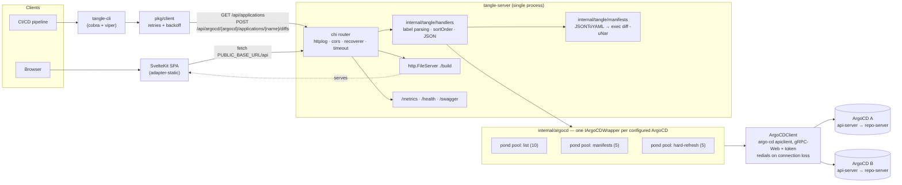

# Internals

How the pieces fit together at runtime. For the technology choices and the reasoning behind them,
see [Architecture](../architecture.md)
([published](https://ivanklee86.github.io/tangle/architecture/)).

Tangle is a stateless fan-out proxy in front of N ArgoCD API servers. A single Go binary
([`tangle-server`](https://github.com/ivanklee86/tangle/blob/main/cmd/tangle-server/main.go)) serves
the REST API, an embedded Swagger UI, Prometheus metrics, and the pre-built static SPA. A second
binary ([`tangle-cli`](https://github.com/ivanklee86/tangle/blob/main/cmd/tangle-cli/main.go))
consumes that same API so pipelines and humans have feature parity.

## Topology

## Request paths

- **`GET /api/applications?labels=k:v&excludeLabels=k:v`** — validates both parameters
  (`internal/tangle/labels.go`), then fans out over every configured ArgoCD, translating labels into a
  single Kubernetes selector (`k=v,k!=v`, sorted so the string is deterministic), and returns
  per-instance results ordered by `sortOrder`. Deep links back into each ArgoCD UI are synthesized
  from the instance address and scheme (`http`/`https`, from that instance's `plainText`/`insecure`
  config). A malformed segment, a key repeated within a parameter, or a key shared between both
  parameters at the same value is a `400` before any fan-out — see
  [ADR 0026](../adrs/0026-reject-malformed-label-query-parameters.md). The selector is attached
  whenever *either* map is non-empty, so an exclude-only query filters rather than listing everything.
- **`POST /api/argocd/{argocd}/applications/{name}/diffs`** — submits a `refresh=hard` `Get` on the
  hard-refresh pool, then generates manifests for `liveRef` and `targetRef` concurrently on the
  manifests pool, converts each to YAML, and shells out to `diff -uNar` over two tempfiles.

Every pool is a [`alitto/pond`](https://github.com/alitto/pond) worker pool sized per-instance via
config; this is the throttle that keeps Tangle from overwhelming ArgoCD's `repo-server`. Pools are
registered as Prometheus `GaugeFunc`/`CounterFunc` collectors labeled `pool` + `argocd`
(`internal/argocd/metrics.go`), unless `DoNotInstrument` is set.

## Connections to ArgoCD

`ArgoCDClient` sets `GRPCWeb: true`, so argo-cd's apiclient never dials ArgoCD directly: it starts a
local gRPC → gRPC-Web reverse proxy on a unix socket (`/tmp/argocd-<random>.sock`) and points the gRPC
client at that. Every RPC goes client → socket → proxy → gRPC-Web → ArgoCD. gRPC-Web is hardcoded
rather than configurable because Tangle can't know whether a given ArgoCD sits behind an ingress that
carries native gRPC.

That connection can't re-establish itself — argo-cd's `BlockingNewClient` dials once and reuses the
same `net.Conn` for every subsequent "dial" — so the client owns recovery. Each `ArgoCDClient` holds
one connection behind a mutex; an RPC that fails with `codes.Unavailable`, or `codes.Canceled` while
its request context is still live, triggers one redial and one retry. Concurrent failures from a pool
fan-out collapse into a single redial via a generation counter, and the replaced connection is closed,
which is what stops the old proxy and unlinks its socket. `Close()` does the same at shutdown. Dials
are counted by `argocd_client_dials_total{argocd,reason,result}` and
`argocd_client_connection_generation{argocd}` — unlike the pool collectors, these are always
registered. See [ADR 0025](../adrs/0025-reconnect-the-argocd-grpc-client.md).

A client whose first dial fails is kept and connects lazily on first use, so an ArgoCD that's briefly
down at boot doesn't take the pod with it. A missing `authTokenEnvVar` is still fatal for that
instance: `internal/tangle/server.go` logs it and skips registering a wrapper for it.

## Configuration

[`koanf`](https://github.com/knadh/koanf) layers, last wins: struct defaults → YAML at
`TANGLE_CONFIG_PATH` → `TANGLE_`-prefixed env vars (`_` → `.`). ArgoCD auth tokens are never in the
config file — each instance names an env var (`authTokenEnvVar`) read at client construction.

Env var names are resolved against `TangleConfig`'s `koanf` tags, reflected into a key tree at
startup (`internal/tangle/envkeys.go`): a variable that names no key is dropped and recorded in
`IgnoredEnvVars`, which `New` logs once at `WARN`, and one that does is rewritten to the tag's
own spelling (`TANGLE_LISTWORKERS` → `listWorkers`) so it overrides the file's key instead of
landing beside it. Map keys under `argocds` pass through as written
(`TANGLE_ARGOCDS_TEST_ADDRESS` → `argocds.test.address`), so an ArgoCD instance name containing
`_` can't be targeted this way. The filter exists because Kubernetes injects
`<SERVICE>_PORT_<port>_<proto>_ADDR`-style vars for every Service in the pod's namespace, and a
Service named `tangle` collides with this prefix — see
[ADR 0023](../adrs/0023-resolve-env-var-overrides-against-the-config-schema.md).

The CLI uses [`cobra`](https://github.com/spf13/cobra)/[`viper`](https://github.com/spf13/viper)
with the same `TANGLE_` prefix.

`tangle-cli generate-manifests` is the CLI's only subcommand, and one run produces both manifests and diffs. For each matched application it writes `manifests-<argocd>-<app>.yaml` and `diff-<argocd>-<app>.yaml`, plus `error-<argocd>-<app>.txt` when manifest generation fails. Files go to `--folder`, or to the working directory when that flag is left out. A generation error only makes the CLI exit non-zero with `--fail-on-error`; a failure to reach the server always exits 1.

## Live test fixtures

The live stack (`task services:cicd`) seeds the four Applications in `integration/kubernetes/example/`, all tracking `main` on GitHub rather than the local checkout. The `test_gitops` branch on `origin` stands in for "a change the user pushed": it enables `test-1`'s ingress (so its diff adds one `Ingress`) and deliberately breaks `test-3`'s `values.yaml` (so manifest generation fails), leaving `test-2` and `test-4` unchanged. The scenario tests for [test_cases.md](test_cases.md) (`cmd/tangle-cli/main_e2e_test.go`, `web/e2e/live/ci-scenarios.spec.ts`) and the other live suites rely on exactly this, so treat `test_gitops` as a test fixture: don't rebase or "fix" it.

## Build

Multi-stage [`Dockerfile`](https://github.com/ivanklee86/tangle/blob/main/Dockerfile): stage 1 runs
[`swagger generate spec`](https://goswagger.io/) (the result is `go:embed`ed and served at
`/swagger`) then `go build`; stage 2 runs `npm run build` against the
[SvelteKit](https://svelte.dev/docs/kit) app; stage 3 is a non-root Alpine image holding
`tangle-server`, `tangle-cli`, and `./build`. The server resolves static assets from `./build`
relative to its working directory, so the API and the SPA are always the same deploy.
