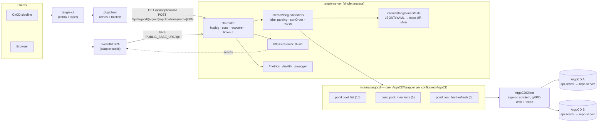

# Internals

How the pieces fit together at runtime. For the technology choices and the reasoning behind them,
see [Architecture](../architecture.md)
([published](https://ivanklee86.github.io/tangle/architecture/)).

Tangle is a stateless fan-out proxy in front of N ArgoCD API servers. A single Go binary
([`tangle-server`](https://github.com/ivanklee86/tangle/blob/main/cmd/tangle-server/main.go)) serves
the REST API, an embedded Swagger UI, Prometheus metrics, and the pre-built static SPA. A second
binary ([`tangle-cli`](https://github.com/ivanklee86/tangle/blob/main/cmd/tangle-cli/main.go))
consumes that same API so pipelines and humans have feature parity.

## Topology

## Request paths

- **`GET /api/applications?labels=k:v&excludeLabels=k:v`** — fans out over every configured ArgoCD,
  translating labels into a single Kubernetes selector (`k=v,k!=v`), and returns per-instance results
  ordered by `sortOrder`. Deep links back into each ArgoCD UI are synthesized from the instance address.
- **`POST /api/argocd/{argocd}/applications/{name}/diffs`** — submits a `refresh=hard` `Get` on the
  hard-refresh pool, then generates manifests for `liveRef` and `targetRef` concurrently on the
  manifests pool, converts each to YAML, and shells out to `diff -uNar` over two tempfiles.

Every pool is a [`alitto/pond`](https://github.com/alitto/pond) worker pool sized per-instance via
config; this is the throttle that keeps Tangle from overwhelming ArgoCD's `repo-server`. Pools are
registered as Prometheus `GaugeFunc`/`CounterFunc` collectors labeled `pool` + `argocd`
(`internal/argocd/metrics.go`), unless `DoNotInstrument` is set.

## Configuration

[`koanf`](https://github.com/knadh/koanf) layers, last wins: struct defaults → YAML at
`TANGLE_CONFIG_PATH` → `TANGLE_`-prefixed env vars (`_` → `.`). ArgoCD auth tokens are never in the
config file — each instance names an env var (`authTokenEnvVar`) read at client construction.
The CLI uses [`cobra`](https://github.com/spf13/cobra)/[`viper`](https://github.com/spf13/viper)
with the same `TANGLE_` prefix.

## Build

Multi-stage [`Dockerfile`](https://github.com/ivanklee86/tangle/blob/main/Dockerfile): stage 1 runs
[`swagger generate spec`](https://goswagger.io/) (the result is `go:embed`ed and served at
`/swagger`) then `go build`; stage 2 runs `npm run build` against the
[SvelteKit](https://svelte.dev/docs/kit) app; stage 3 is a non-root Alpine image holding
`tangle-server`, `tangle-cli`, and `./build`. The server resolves static assets from `./build`
relative to its working directory, so the API and the SPA are always the same deploy.
